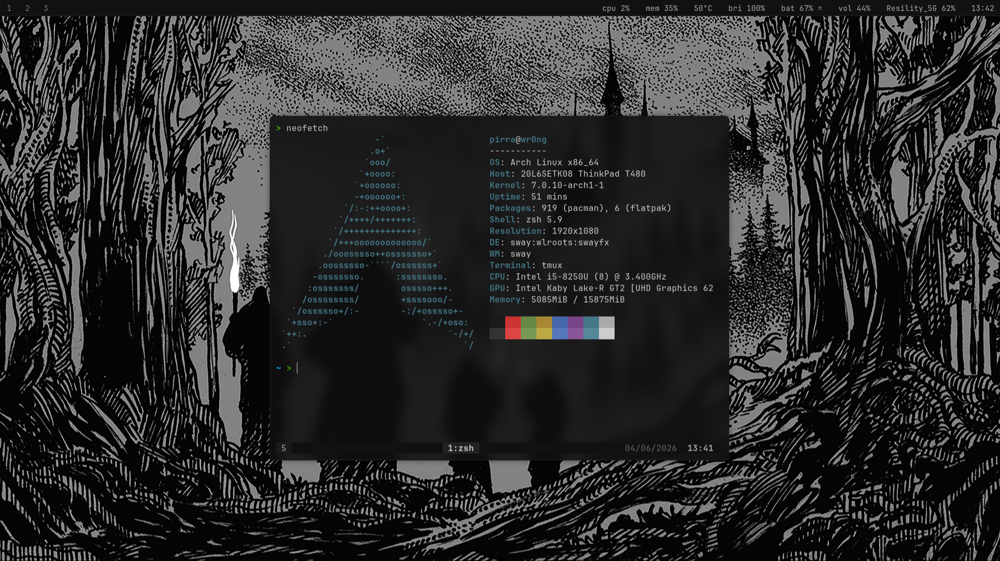
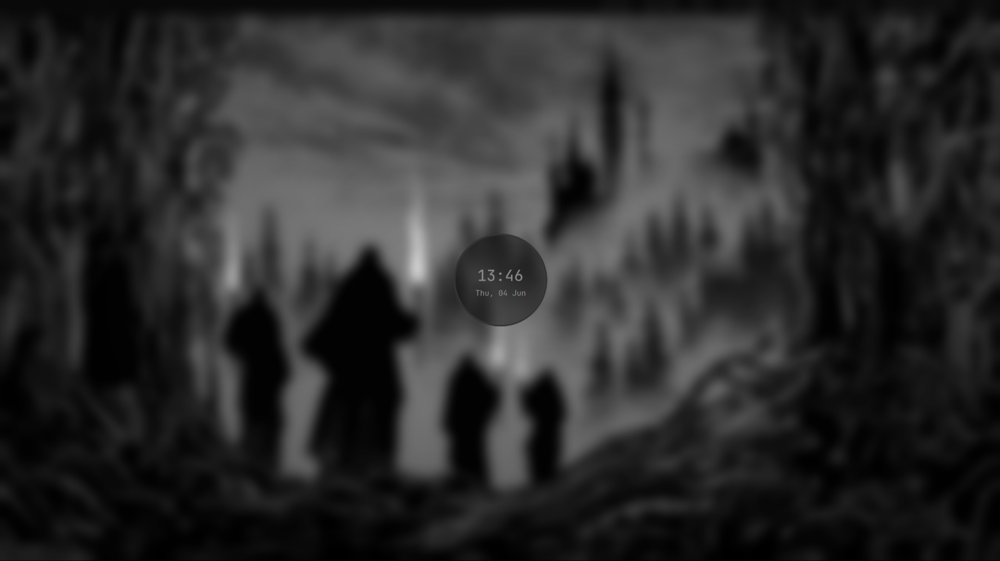

# sway-dotfiles (ultra-ligero)

Configuración personal para Arch Linux + Sway con repositorios Black Arch.

## Preview




## Stack

- **WM**: Sway (Wayland)
- **Bar**: Waybar
- **Launcher**: Wofi
- **Terminal**: Alacritty + Tmux
- **Shell**: Zsh + Powerlevel10k
- **Notificaciones**: Mako
- **Lockscreen**: Swaylock-effects

## Instalación

```bash
git clone https://github.com/Pirrandi/sway-dotfiles.git
cd sway-dotfiles
chmod +x install.sh
./install.sh
```

## Atajos principales

| Atajo | Acción |
|-------|--------|
| `Super+Return` | Terminal |
| `Super+D` | Launcher |
| `Super+Q` | Cerrar ventana |
| `Super+Shift+R` | Recargar Sway |
| `Super+Shift+L` | Lockscreen |
| `Super+Print` | Screenshot área |
| `Print` | Screenshot completo |
| `Super+1-9` | Cambiar workspace |
| `Super+Shift+1-9` | Mover ventana a workspace |
| `Super+H/J/K/L` | Navegar ventanas |
| `Super+Shift+H/J/K/L` | Mover ventanas |
| `Super+F` | Fullscreen |
| `Super+Shift+Space` | Floating toggle |
