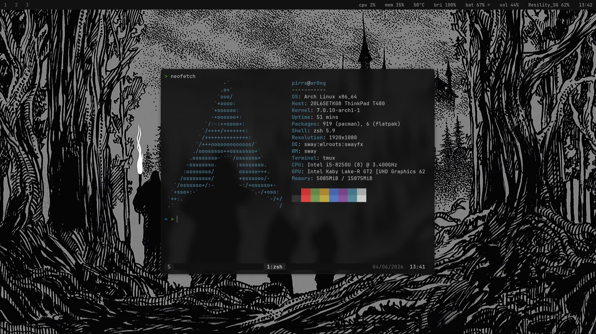
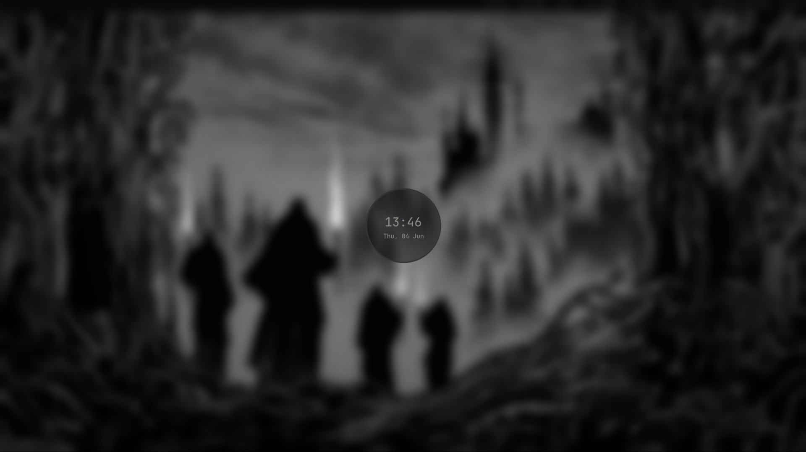

# sway-dotfiles (ultra-ligero)

Configuración personal para Arch Linux + Sway: ligera, pero completa. Un solo `install.sh` deja el sistema igual en cualquier máquina.

## Preview




## Stack

- **WM**: Sway (Wayland)
- **Bar**: Waybar
- **Launcher**: Wofi
- **Terminal**: Alacritty + Tmux
- **Shell**: Zsh + Powerlevel10k
- **Notificaciones**: Mako
- **Lockscreen**: Swaylock-effects
- **Editor**: Neovim + LazyVim
- **Shell extras**: fzf (`Ctrl+R`, `Ctrl+T`), eza, autosuggestions

## Instalación

```bash
git clone https://github.com/Pirrandi/sway-dotfiles.git
cd sway-dotfiles
chmod +x install.sh
./install.sh
```

## Atajos principales

### Ventanas y sesión

| Atajo | Acción |
|-------|--------|
| `Super+Return` | Terminal (Alacritty + tmux) |
| `Super+D` | Launcher |
| `Super+Q` | Cerrar ventana |
| `Super+H/J/K/L` o flechas | Mover el foco |
| `Super+Shift+H/J/K` o flechas | Mover ventana (`Shift+L` es lock, usá `Shift+→`) |
| `Super+F` | Fullscreen |
| `Super+Shift+Space` | Toggle floating |
| `Super+T` / `Super+Shift+T` / `Super+S` | Layout default / tabbed / stacking |
| `Super+Shift+I` | Modo resize |
| `Super+Shift+R` | Recargar Sway |
| `Super+Shift+L` | Lockscreen |
| `Super+Shift+Q` | Salir de Sway |

### Contextos y workspaces

Cada contexto (`personal`, `work`, …) tiene sus propios workspaces del 1 al 10.

| Atajo | Acción |
|-------|--------|
| `Super+1-0` | Ir al workspace N del contexto activo |
| `Super+Shift+1-0` | Mover la ventana al workspace N del contexto activo |
| `Super+F1-Fn` | Cambiar de contexto |
| `Super+Ctrl+W` | Menú de contextos (ir, mover, crear) |
| `Super+Ctrl+M` | Mover la ventana a cualquier contexto/workspace |
| `Super+Tab` | Workspace anterior |

### Utilidades

| Atajo | Acción |
|-------|--------|
| `Print` / `Super+Print` | Screenshot completo / de área → `~/Pictures/Screenshots` + clipboard |
| `Super+Shift+S` | Área solo al clipboard |
| `Super+Ctrl+S` | Área → editor swappy |
| `Super+Shift+V` | Historial del portapapeles |
| `Super+Space` | Addons: filtro de luz azul, portapapeles, no molestar |
| `Super+Shift+A` | Elegir salida de audio |
| `Super+Ctrl+Space` | Cambiar layout de teclado (us / latam) |
| `Super+Alt+C/X/G/S` | warpd: mouse con teclado (normal / hint / grid / screen) |
| `Super+O` / `Super+Alt+M` | Scratchpad: OTPClient / Tidal |
